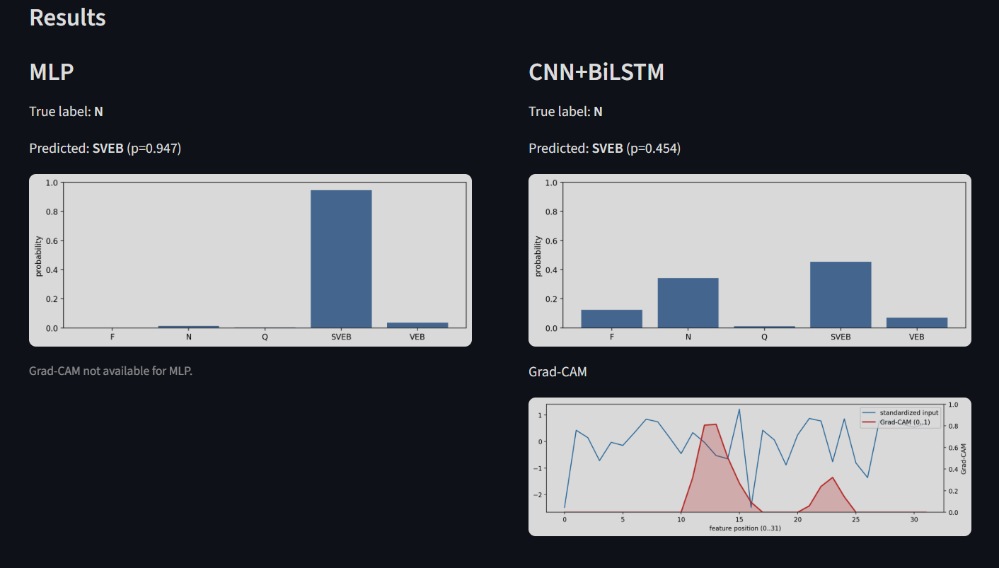

# ECG Arrhythmia Classification (1D CNN + BiLSTM)

This project trains a deep learning model to classify ECG heartbeats into **5 classes** using the provided feature CSVs:

- **N**: Normal
- **SVEB**: Supraventricular ectopic beat
- **VEB**: Ventricular ectopic beat
- **F**: Fusion beat
- **Q**: Unknown beat

Although the original ECG signals are time-series, this dataset contains **engineered features** per heartbeat (lead II + lead V5). To keep the model aligned with the “CNN + BiLSTM on sequences” idea, we treat the **32 numeric features** (all columns except `record` and `type`) as a **1D sequence of length 32** with 1 channel.

## Folder layout

- `data/raw/`: extracted CSVs (already present after unzipping)
- `artifacts/`: saved models, plots, metrics (created by scripts)
- `src/`: code

## Setup

Create a Python environment (3.10+ recommended). (If you're on Python 3.14, this repo uses **PyTorch** because TensorFlow wheels may not be available yet.)

```bash
pip install -r requirements.txt
```

## Train

Train on one dataset CSV (default uses MIT-BIH Arrhythmia Database):

```bash
python -m src.train --csv "data/raw/MIT-BIH Arrhythmia Database.csv" --arch cnn_bilstm
```

Train an MLP baseline (recommended to try first for engineered features):

```bash
python -m src.train --csv "data/raw/MIT-BIH Arrhythmia Database.csv" --arch mlp --use-class-weights
```

Useful options:

```bash
python -m src.train --csv "data/raw/MIT-BIH Arrhythmia Database.csv" ^
  --arch cnn_bilstm --epochs 20 --batch-size 256 --use-class-weights ^
  --artifact-dir artifacts/mitbih_cnn
```

Enable SMOTE (optional; can help, but is not always better):

```bash
python -m src.train --csv "data/raw/MIT-BIH Arrhythmia Database.csv" --arch mlp --use-smote
```

## Compare (MLP vs CNN+BiLSTM)

Runs both models with the same settings and prints macro-F1:

```bash
python -m src.compare --csv "data/raw/MIT-BIH Arrhythmia Database.csv" --epochs 10 --use-class-weights
```

## Explain (1D Grad-CAM)

After training, run Grad-CAM on a few validation samples:

```bash
python -m src.explain --run-dir artifacts/mitbih --num-samples 5
```

This produces a plot where the “heat” shows **which feature positions** (0..31) most influenced the prediction through the final Conv1D layer.

## Interactive inference (Streamlit)

Launch the local app:

```bash
python -m streamlit run app.py
```

In the sidebar, set **Run directory** to a trained folder like:

- `artifacts/compare/cnn_bilstm`
- `artifacts/compare/mlp`


## What to expect

- The dataset is **highly imbalanced** (e.g., `Q` is extremely rare). The default training uses **weighted cross-entropy** via class weights.
- Metrics include accuracy + a per-class classification report.

## Performance Results

Based on the evaluation of both the Multilayer Perceptron (MLP) baseline and the CNN+BiLSTM model over 10 epochs using the MIT-BIH Arrhythmia Database, the deep learning sequence model outperformed the baseline.

The evaluation was conducted using Macro F1-Score, which computes the metric independently for each class and then takes the unweighted mean, making it a robust metric for this highly imbalanced dataset where some classes (like 'Q') are extremely rare.

**Model Comparison (Macro Avg F1-Score):**
- **MLP Baseline:** 0.6069
- **CNN+BiLSTM:** 0.6482

**Per-Class Performance Breakdown (CNN+BiLSTM vs MLP at Epoch 10):**
- **Normal (N):** 0.974 vs 0.967
- **Supraventricular ectopic beat (SVEB):** 0.610 vs 0.586
- **Ventricular ectopic beat (VEB):** 0.907 vs 0.907
- **Fusion beat (F):** 0.738 vs 0.575
- **Unknown beat (Q):** 0.011 vs 0.000

The sequence-based CNN+BiLSTM architecture demonstrates a clear advantage in capturing the underlying patterns within the 32 engineered features, treating them as a sequence. It showed notable improvements in classifying difficult minority classes, particularly the Fusion beats (F), while maintaining near-perfect accuracy on the majority Normal (N) class. The 1D Convolutions effectively extract local feature combinations, and the Bidirectional LSTM captures the context across the entire 32-feature sequence, leading to a superior overall macro F1-score.


